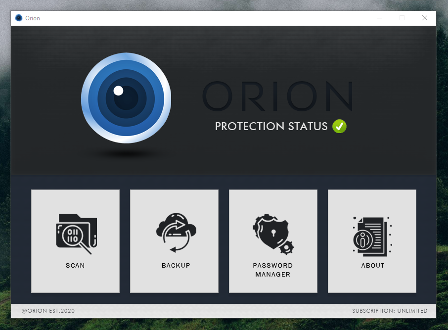
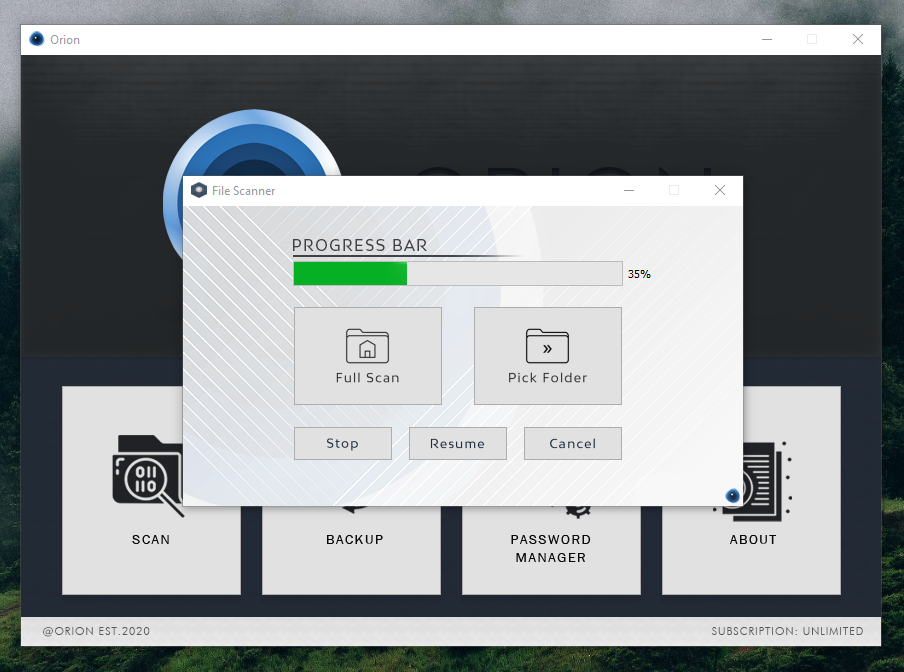
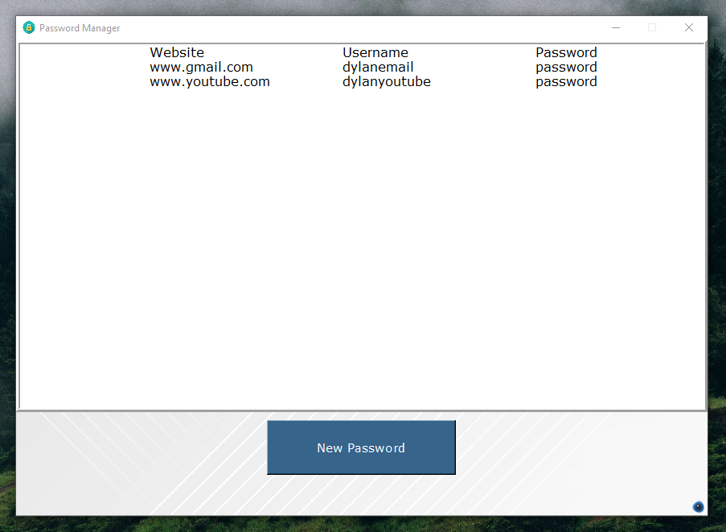
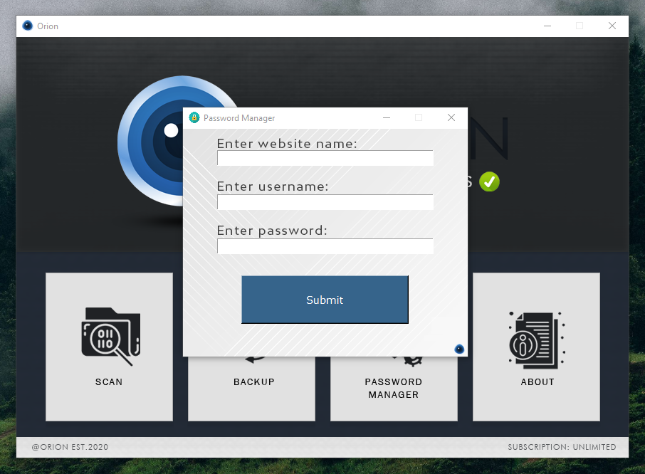

# orion
> virus protection software.

## Table of contents
* [General info](#general-info)
* [Screenshots](#screenshots)
* [Technologies](#technologies)
* [Setup](#setup)
* [Features](#features)
* [Inspiration](#inspiration)

## General info
Orion was designed as an experimental project that's main purpose was to experiement with designing a more full scale anti-virus software. 
I hope that you enjoyed the project, clone it if you want to test it out. I enjoyed making this and hope to further 
advance it in the coming future.

[Demo Video](https://youtu.be/zjYu5025mgo)

## Screenshots


{:class="img-responsive"}


## Technologies
* Python (main language)
* Qt (PyQt5)
* Tkinter
* Yara

## Setup
1. Clone the repo
```sh
git clone https://github.com/dylansloann/orion
```
2. Install modules in Technologies (PyQt5, Tkinter, Yara)

3. Run main.py

## Features
* Full scan of home directory or directed scan of any folder along with sub folders.
* Full backup of any specified directory (including entire drive).
* Integrated password manager, that includes secure login.

## Inspiration
Project was inspired by past project Antihax.