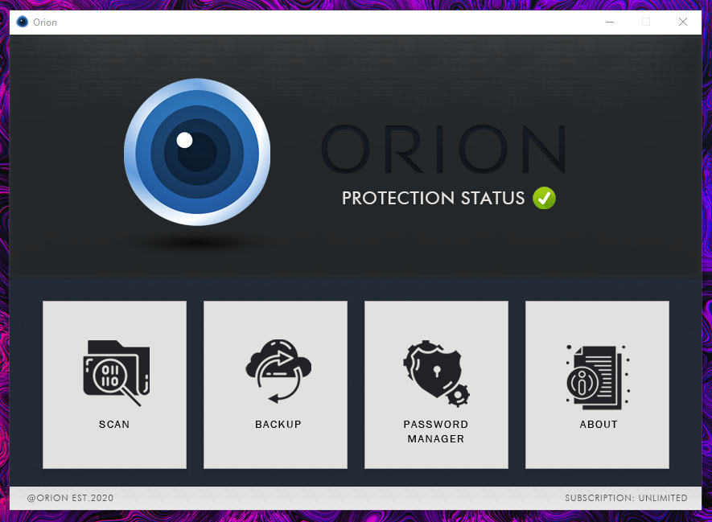

# Orion
> Orion is virus protection software geared more to the simple side of features.

## Table of contents
* [General info](#general-info)
* [Screenshots](#screenshots)
* [Technologies](#technologies)
* [Setup](#setup)
* [Features](#features)
* [Inspiration](#inspiration)

## General info
Orion was designed as an experimental project that's main purpose was to experience the enjoyment of making a full-scale anti-virus softawre. 
I hope that you enjoyed the project, and maybe even attempted to check out its features. I greatly enjoyed making this and hope to further 
advance it in the coming future.

## Screenshots



## Technologies
* Python (main language)
* Qt (PyQt5)
* Tkinter
* Yara

## Setup
1. Clone the repo
```sh
git clone https://github.com/dylansloann/orion
```
2. Extract Files

3. Install modules in Technologies (PyQt5, Tkinter, Yara)

3. Run main.py

## Features
* Full scan of home directory or directed scan of any folder along with sub folders.
* Full backup of any specified directory (including entire drive).
* Integrated password manager, that includes secure login.

## Inspiration
Project was inspired by past project Antihax.